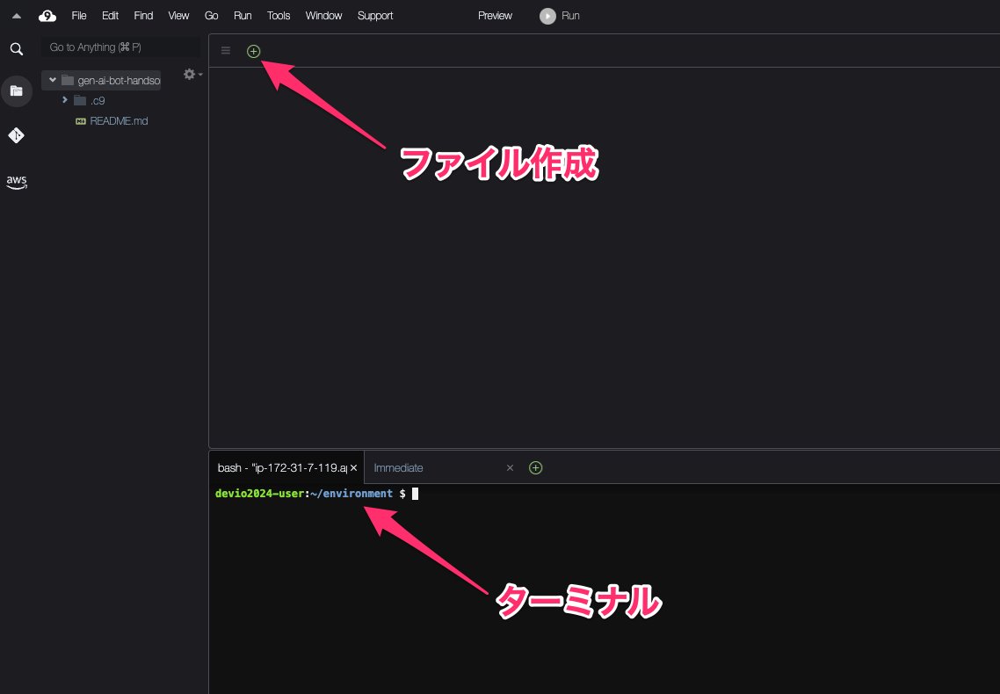

# 1.1 Cloud9の設定

本ハンズオンでは、AWS Cloud9上で開発を行います。
以下のリンクよりAWS Cloud9のコンソールを開きます。

[コンソールはこちら](https://ap-northeast-1.console.aws.amazon.com/cloud9control/home?region=ap-northeast-1#/product)


作成画面では、以下の入力を行い、ページ下部の「作成」をクリックします。

- 名前
  - gen-ai-bot-handson
- 接続
  - セキュアシェル (SSH)


作成後、ステータスが「準備完了」となるまでしばらく待機します。

ステータスが「準備完了」になりましたら、「Cloud9 で開く」をクリックします。


以下のような画面が開きます。



次に、開発に利用するライブラリのインストールを行います。

まずは、[requirements.txt](/app/requirements.txt)の作成を行います。


requirements.txtの作成後、以下のコマンドをターミナル上から実行します。

```shell
pip3 install -r requirements.txt 
```

その後、以下のコマンドも実行します。

```shell
pip3 install boto3
```

**実行結果の様子**


エラーなく実行ができましたら、「Cloud9の設定」は終了となります🎉🎉

次のセクションでは、実際に Bedrock でテキスト生成を行います。

[次のセクションへ](/docs/2.1.md)
