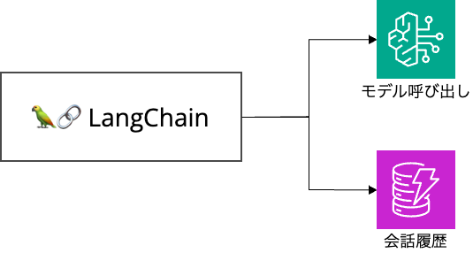

# 2.1 LangChainについて

[LangChain](https://python.langchain.com/v0.1/docs/get_started/introduction) は、大規模言語モデル (LLM) に基づいてアプリケーションを構築するためのオープンソースフレームワークです。

LangChainを利用することで、複数のAIモデルの連携、外部データソースとの統合、メモリ機能の実装など、LLMを用いた高度な機能を簡単に構築できます。

本ハンズオンでは、LangChainを通してBedrockを利用します。

また、Slack内で会話履歴もLangChainを通して実装します。

## LangChain 利用例

- [エージェント機能](https://dev.classmethod.jp/articles/bedrock-langchain-agent/)
- Retrieval-Augmented Generation (RAG) 実装例
    - https://dev.classmethod.jp/articles/rag-slack-chatbot/
    - https://zenn.dev/team_nishika/articles/481ecd7f48b8be
- [監視ツール](https://zenn.dev/nano_sudo/articles/25d96cb6ee1dd3)

[次のセクションへ](/docs/2.2.md)
