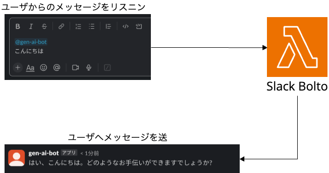

# 3.1 Slack Boltについて

Slack Bolt は、Slackアプリケーションを簡単に開発するためのフレームワークです。

対応言語は、JavaScript (Node.js)、Python 、Java となっています。

従来のSlack APIよりも直感的で使いやすく設計されているため、はじめてチャットボットアプリを構築する際には最適なフレームワークとなります。

また、Boltの最大の特徴は、AWS Lambda に特化した Lazy listeners を使い、非同期処理を簡単に実現できます。

特に生成 AI では、モデルからのレスポンスまでに時間を要すため、Lazy listeners を用いると良いでしょう。

なお、本ハンズオンでは、わかりやすさの都合上、Lazy listeners は用いません。

この機能が気になる方は、以下の記事をご参照ください。

[Lazy listener について](https://dev.classmethod.jp/articles/bolt-lambda/)

[次のセクションへ](/docs/3.2.md)

