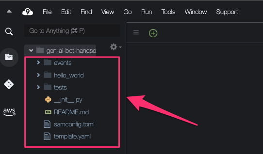

# 3.2 AWS SAMでアプリケーション開発

## AWS SAMのセットアップ

それでは、実際にアプリケーションの作成を行います。

本ハンズオンでは、AWS Serverless Application Model（AWS SAM）を使って開発を行います。

[AWS SAMとは](https://docs.aws.amazon.com/ja_jp/serverless-application-model/latest/developerguide/what-is-sam.html)

まずは、Cloud9で、カレントディレクトを確認してください。

```shell
cm-morita.chikara:~/environment $ pwd
/home/ec2-user/environment
```
上記のように`/home/ec2-user/environment`となっていれば問題ありません。

続いて、以下のコマンドを実行して、SAMのセットアップを行います。


```shell
sam init --runtime python3.9 --dependency-manager pip \
--app-template hello-world --name gen-ai-slack-bot --no-interactive
```

実行が完了すると、最小限のプロジェクトが作成されます。


以下のコマンドを実行し、カレントディレクトリにファイルを配置します。

```
mv gen-ai-slack-bot/* ./ && rm -r gen-ai-slack-bot/ 
```



## コードの作成

SAMでは、構築するリソースは、`template.yaml`に記載します。

初期の内容から、以下のように変更します。

```yaml
AWSTemplateFormatVersion: '2010-09-09'
Transform: AWS::Serverless-2016-10-31
Description: >
  gen-ai-bot

  Sample SAM Template for gen-ai-bot


Parameters:
  LayerIs:
    Type: String
  TableKeyName:
    Type: String
    Default: sessionId
  SecretName:
    Type: String
    Default: gen-ai-bot-handson
  LambdaFunctionName:
    Type: String
    Default: gen-ai-slack-bot
  ModelId:
    Type: String
  ModelRegion:
    Type: String

Conditions:
  LayerIsCondition: 
    !Equals [true, !Ref LayerIs]

# More info about Globals: https://github.com/awslabs/serverless-application-model/blob/master/docs/globals.rst
Globals:
  Function:
    Timeout: 90
    MemorySize: 128

Resources:
  GenAIBotFunction:
    Type: AWS::Serverless::Function 
    Properties:
      CodeUri: app/
      FunctionName: !Ref LambdaFunctionName
      Handler: handler.lambda_handler
      Runtime: python3.9
      Role: !GetAtt GenAIBotRole.Arn
      Architectures:
        - x86_64
      Layers:
        - !If [LayerIsCondition, "arn:aws:lambda:ap-northeast-1:133490724326:layer:AWS-Parameters-and-Secrets-Lambda-Extension:11", !Ref "AWS::NoValue"]
      Environment:
        Variables:
          KeyName: !Ref TableKeyName
          SecretName: !Ref SecretName
          ModelId: !Ref ModelId
          ModelRegion: !Ref ModelRegion
      Events:
        BotEvent:
          Type: Api 
          Properties:
            Path: /
            Method: post

  GenAIBotRole:
    Type: AWS::IAM::Role
    Properties:
      AssumeRolePolicyDocument:
        Version: "2012-10-17"
        Statement:
          - Effect: "Allow"
            Action: "sts:AssumeRole"
            Principal:
              Service: lambda.amazonaws.com
      Policies:
        - PolicyName: "bedrock-invoke"
          PolicyDocument:
            Version: "2012-10-17"
            Statement:
              - Effect: "Allow"
                Action:
                  - "bedrock:InvokeModel"
                Resource: "*"
        - PolicyName: "secretsmanager-get"
          PolicyDocument:
            Version: "2012-10-17"
            Statement:
              - Effect: "Allow"
                Action:
                  - "secretsmanager:GetSecretValue"
                Resource: !Sub "arn:aws:secretsmanager:${AWS::Region}:${AWS::AccountId}:secret:gen-ai-bot-handson*"
        - PolicyName: "logging-allow"
          PolicyDocument:
            Version: "2012-10-17"
            Statement:
              - Effect: "Allow"
                Action:
                  - 'logs:CreateLogGroup'
                Resource: !Sub "arn:aws:logs:${AWS::Region}:${AWS::AccountId}:*"
              - Effect: "Allow"
                Action:
                  - 'logs:CreateLogStream'
                  - 'logs:PutLogEvents'
                Resource: !Sub "arn:aws:logs:${AWS::Region}:${AWS::AccountId}:log-group:/aws/lambda/${LambdaFunctionName}:*"

Outputs:
  SlackApi:
    Description: "API Gateway endpoint URL for Prod stage for Slack BOT"
    Value: !Sub "https://${ServerlessRestApi}.execute-api.${AWS::Region}.amazonaws.com/Prod/"
  GenAIBotFunction:
    Description: Lambda Function ARN"
    Value: !GetAtt GenAIBotFunction.Arn
```

また、`samconfig.toml`のファイル内容も以下に変更します。

```shell
# More information about the configuration file can be found here:
# https://docs.aws.amazon.com/serverless-application-model/latest/developerguide/serverless-sam-cli-config.html
version = 0.1

[default]
[default.global.parameters]
stack_name = "gen-ai-bot"
region = "ap-northeast-1"
parameter_overrides = [
    "LayerIs=true",
    "ModelId='anthropic.claude-3-haiku-20240307-v1:0'",
    "ModelRegion='us-east-1'"
]

[default.build.parameters]
cached = true
parallel = true

[default.validate.parameters]
lint = true

[default.deploy.parameters]
capabilities = "CAPABILITY_IAM"
confirm_changeset = true
resolve_s3 = true

[default.package.parameters]
resolve_s3 = true

[default.sync.parameters]
watch = true

[default.local_start_api.parameters]
warm_containers = "EAGER"
parameter_overrides = [
    "LayerIs=false"
]

[default.local_start_lambda.parameters]
warm_containers = "EAGER"
parameter_overrides = [
    "LayerIs=false"
]
```

`samconfig.toml`では、環境変数の指定等を行います。

続いて、アプリケーションのコードを作成します。

まずは、必要なファイル、フォルダを以下のコマンドから作成します。

```shell
mv hello_world app && rm app/app.py && touch app/handler.py && cd app
```

`app/handler.py`へ以下のコードを記載します。

```python
import logging
import json, os
from slack_bolt.adapter.aws_lambda import SlackRequestHandler
from slack_bolt import App, Say


def lambda_handler(event, context):
    header = event["headers"]
    if header.get("X-Slack-Retry-Num"):
        return {
            "statusCode": 200
        }
    
    from slack_app import app
    import events.mention
    import events.error

    slack_handler = SlackRequestHandler(app=app)

    return slack_handler.handle(event, context)
```

handler.pyでは、Slackから AWS Lambda へリクエストされたメンションイベントとエラーイベントのハンドリングを行います。

では、メンションイベントとエラーイベント時の処理内容を作成していきます。

まずは、以下のコマンドでフォルダとファイルの作成を行います。

```shell
mkdir events && touch events/mention.py && touch events/error.py
```

`events/mention.py`へ以下のコードを記載します。

```python
import json
import time
from lib.chat import chat_simple
from lib.common import preprocessing
from slack_app import app


@app.event("app_mention")
def mention(event, say):
    text = preprocessing(event["text"])

    content = chat_simple(text)

    say(
        channel=event["channel"],
        thread_ts=event["ts"],
        text=content
    )
```

ここでは、SlackBotがメンションされた場合の処理を定義しています。

メンションされた時のテキストを取得し、`chat_simple関数`を実行し、生成AIから回答文を作成します。


続いて、`events/mention.py`へ以下のコードを記載します。

```python
import logging
from slack_app import app

@app.error
def handle_error(event, say, error, logger):
    logger.exception(error)
    say(
        channel=event["channel"],
        thread_ts=event["ts"],
        text=f"エラーが発生しました\n{error}"
    )
```

今度は、以下のコマンドを実行して、lib内のファイルをダウンロードします。

```shell
wget https://gen-ai-slack-bot-devio2024.s3.ap-northeast-1.amazonaws.com/lib-v1.zip && unzip lib-v1.zip && rm lib-v1.zip
```

lib内の各ファイルについては、以下のような処理を行います。

| ファイル名 | 処理 |
| --- | --- |
| chat.py | 2.2で作成したsimple_chat関数<br>生成AIから回答を取得する |
| common.py | preprocessing関数<br>テキストの前処理を行う |
| secret.py | get_secret関数<br>Slack認証情報を取得する |


以下のコマンドを実行して、`slack_app.py`を作成します。

```shell
touch slack_app.py
```

`slack_app.py`へ以下のコードを記載します。


```python
import logging, os
from slack_bolt import App
from lib.secret import get_secret, local_get_secret

SECRET_NAME = os.environ.get('SecretName')

secure_tokens = get_secret(SECRET_NAME)
signing_secret = secure_tokens.get("SIGNING_SECRET")
token = secure_tokens.get("SLACK_BOT_TOKEN")

app = App(
    process_before_response=True,
    signing_secret=signing_secret,
    token=token,
)

```

最後に、以下のコマンドを実行して、`requirements.txt`をダウンロードします。

```shell
rm requirements.txt && wget https://gen-ai-slack-bot-devio2024.s3.ap-northeast-1.amazonaws.com/requirements.txt
```

## デプロイ

それでは、作成したアプリケーションをデプロイしていきます。

新しいターミナルを開きます。


以下のコマンドを実行します。

```shell
sam build && sam deploy
```

正常に実行が完了すると、以下のようにURLが表示されます。


それでは、次のセクションでは、Slack側の設定を行っていきます。

[次のセクションへ](/docs/3.3.md)
