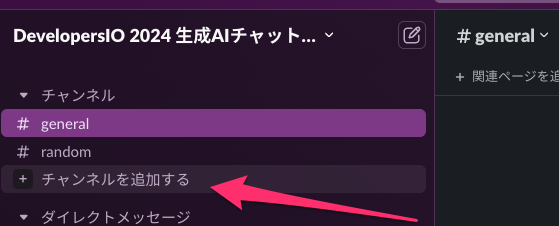
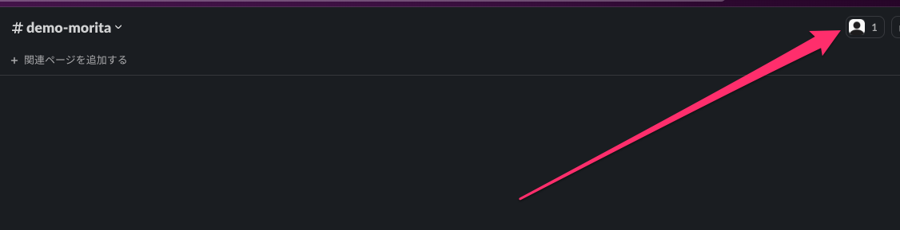
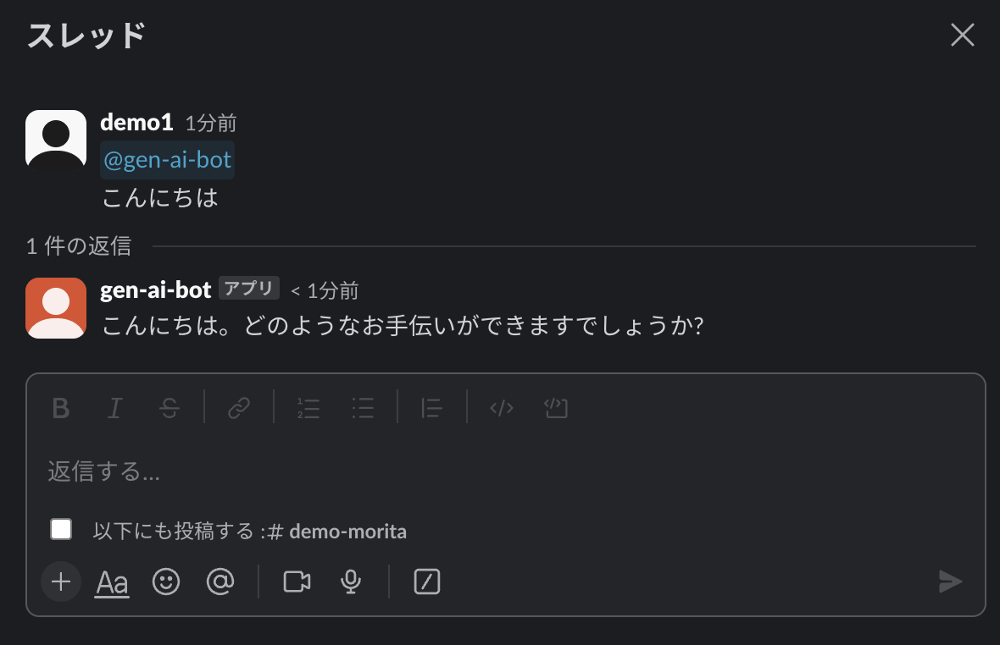

# 3.4 動作確認

Slackにチャンネルを追加します。

チャンネル作成後は、以下のように上部をクリックします。

「インテグレーション」の中にある「アプリを追加する」をクリックし、アプリの追加を完了させます。

その後、以下のようにメンションをつけてメッセージを送信すると、回答が返ってくるようになります。

生成AIチャットボット動かせるようになりました。

お疲れ様でした！

それでは、次のセクションでは、便利に利用できるように「会話履歴を保存」機能を追加していきます。

[次のセクションへ](/docs/4.1.md)