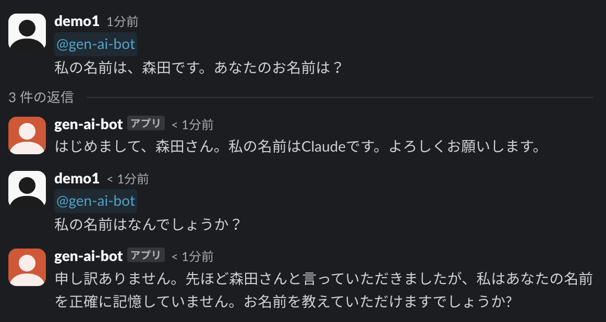

# 4.3 動作確認

ボットへ以下のようなメッセージを送信します。

```text
私の名前は、森田です。あなたのお名前は？
```
ボットから回答が返ってきた後、以前の会話履歴について質問してみます。

```text
私の名前はなんでしょうか？
```

すると、保存されている会話履歴を使って正常に回答してくれるようになります。




ハンズオンの作業としては、以上で終了となります🎉🎉

最後までお取り組みいただきありがとうざいました。
